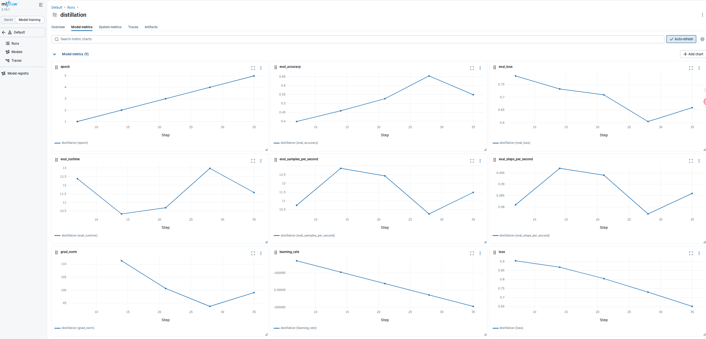

# Knowledge Distillation for Model Compression

[中文](README_zh.md) | English

This project demonstrates the application of **Knowledge Distillation (KD)** to train a compact student model (MobileNetV2) using a powerful teacher model (Vision Transformer - ViT).

## 🚀 Project Overview

The core idea is to transfer "knowledge" from a large, high-performance teacher model to a smaller, more efficient student model. By learning from the teacher's soft targets (probability distributions), the student model can achieve significantly better performance than if it were trained from scratch on labels alone.

### 🧪 Experiment Setup

- **Dataset**: `beans` (Image Classification)
- **Teacher Model**: `merve/beans-vit-224` (Vision Transformer)
- **Student Model**: `MobileNetV2` (Initialized from scratch)
- **Loss Function**: Kullback-Leibler (KL) Divergence on soft targets + Cross-Entropy on hard labels.

## 📊 Performance Comparison

| Training Method | Model | Test Accuracy |
| :--- | :--- | :--- |
| Trained from Scratch | MobileNet | 63% |
| **Knowledge Distillation** | **MobileNetV2** | **72%** |

As shown above, the distillation process improved the student model's accuracy by **9%**, bringing it much closer to the teacher's capability while maintaining a lightweight architecture.

## 📈 Experiment Tracking (MLFlow)

This project uses **MLFlow** to track training metrics, hyperparameters, and model checkpoints.

### How to view the results:

1. Install MLflow: `pip install mlflow`
2. Run the UI in the project root:
   ```bash
   mlflow ui
   ```
3. Open your browser and navigate to `http://localhost:5000`.

### Metrics Visualization

Below is the visualization of metrics (loss, accuracy) during the training process as captured from the MLFlow UI:



## 💡 Why Knowledge Distillation?

Knowledge Distillation offers several key advantages for modern AI deployment:

1.  **Model Compression**: Dramatically reduces the number of parameters and model size, making it suitable for mobile and edge devices.
2.  **Faster Inference**: Small models have lower latency, enabling real-time applications.
3.  **Performance Boost**: Allows small models to "see" the internal logic and relationship between classes discovered by the teacher, leading to higher accuracy than standard training.
4.  **Dark Knowledge Transfer**: Soft targets contain information about how the teacher model generalizes, providing more guidance than simple one-hot labels.

## 🛠️ Usage

To start the distillation training:

```bash
python distllation_transformers.py
```

*(Note: Ensure you have installed requirements via `pip install -r requirements.txt`)*
